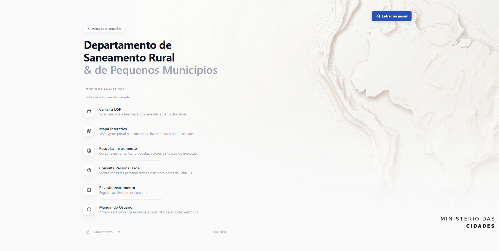
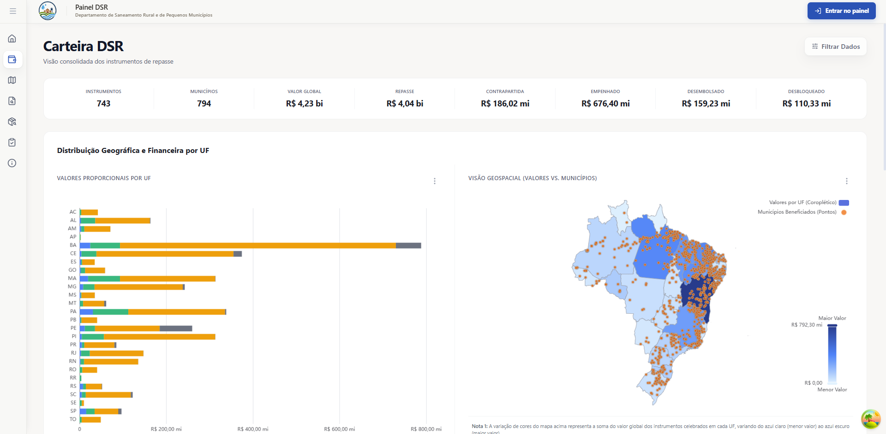
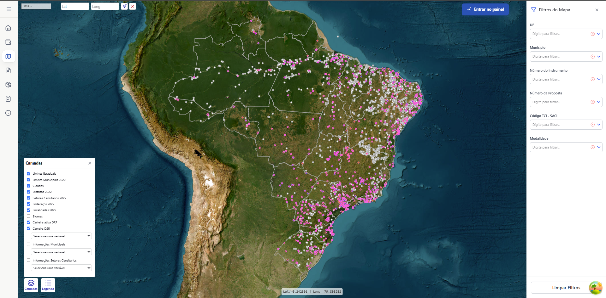
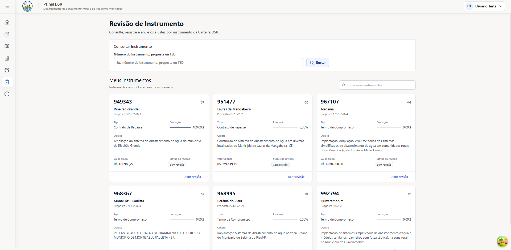
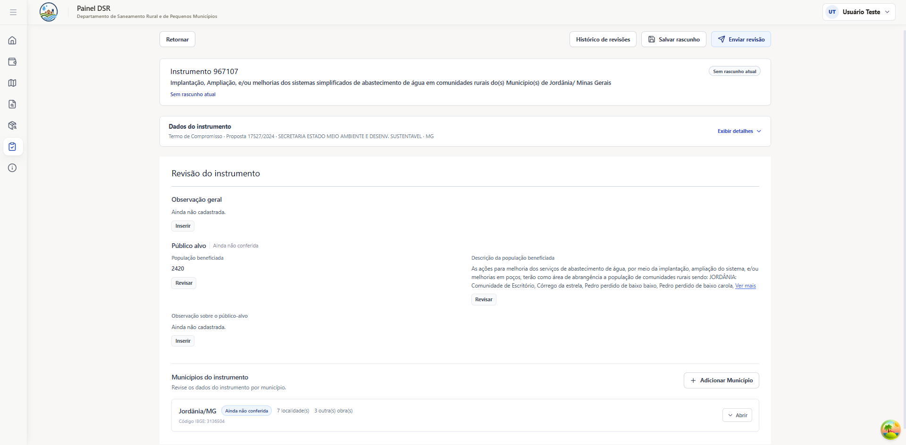

# Painel DSR / Portal DSR

## Sobre o projeto

O Painel DSR é uma ferramenta interna do Departamento de Saneamento Rural e de Pequenos Municípios, pensada para atender exclusivamente às demandas dos técnicos lotados no Departamento, especialmente no tocante às particularidades e especificações das atividades do DSR. O painel reúne dados informações estratégicas para o DSR em um ambiente único de consulta.

O painel depende de bases e estruturas de banco disponibilizadas no ambiente institucional. Endereços, credenciais e demais dados de infraestrutura devem permanecer fora do repositório.

## Funcionalidades

### Página inicial

Centraliza o acesso aos módulos analíticos, ao fluxo de revisão e ao manual do usuário. Também disponibiliza as ações de autenticação conforme o estado da sessão.



### Carteira DSR

Apresenta uma visão consolidada da carteira de instrumentos sob responsabilidade do DSR:

- filtros combináveis, com busca de opções;
- indicadores quantitativos e financeiros;
- gráficos por UF, ação, tipo de instrumento, fase de execução e situação da contratação;
- mapa integrado com valores e instrumentos por UF e por município;
- tabela detalhada e paginada;
- exportação de gráficos em PNG e de dados em Excel.



### Mapa Interativo

Oferece análise geoespacial em MapLibre, com:

- camadas de limites territoriais, cidades, distritos, setores censitários, endereços, localidades, biomas, carteiras de instrumentos e informações municipais;
- filtros por UF, município, localidade, proposta, instrumento, código TCI, modalidade e recortes territoriais;
- simbologias e legendas dinâmicas, consulta por pop-ups e detalhamento municipal;
- navegação por coordenadas e reenquadramento conforme o recorte selecionado;
- análise das coordenadas associadas a instrumentos, com registro de situação e observações;
- exportação da análise de coordenadas em PDF.



### Pesquisa Instrumento

Permite localizar instrumentos por proponente, município beneficiado, número do instrumento, número da proposta ou operação. Os resultados são paginados e dão acesso a uma ficha detalhada com dados de identificação, valores, datas, execução e links de referência. A ficha pode ser exportada em PDF.

### Consulta Personalizada

Funciona como um extrator de dados controlado pelo catálogo do backend. O usuário pode:

- escolher a granularidade da tabela: município, setor censitário ou instrumento DSR;
- combinar colunas organizadas por tema;
- aplicar filtros básicos e avançados;
- conferir a quantidade de registros e gerar uma prévia;
- exportar o resultado em Excel ou CSV.

O módulo aplica limites de volume e regras específicas para consultas amplas, como a exigência de uma UF para extrações por setor censitário.

### Revisão de Instrumento

Módulo autenticado para conferência e registro de ajustes antes da atualização das estruturas consumidas pelo portal. Técnicos editam os instrumentos vinculados ao seu monitoramento; administradores possuem acesso ampliado.

O fluxo implementado contempla:

- pesquisa por instrumento, proposta ou TED e seleção entre instrumentos atribuídos ao usuário;
- abertura e salvamento de rascunho, com bloqueio de rascunhos simultâneos para o mesmo instrumento;
- estados de rascunho, revisão enviada, aplicação pendente, aplicação concluída e aplicação cancelada;
- observação geral e conferência de público-alvo, municípios, localidades e obras;
- inclusão, correção ou remoção de registros conforme as regras de cada seção;
- envio parcial ou completo da revisão;
- histórico pessoal e histórico por instrumento;
- visualização somente leitura de revisões enviadas e comparação entre valores originais e revisados;
- geração de ficha em PDF para os dados de público-alvo;
- solicitação de cancelamento de uma aplicação elegível.

O backend mantém um único rascunho ativo por instrumento e registra as revisões em tabelas próprias do schema `painel_dsr`. O envio não altera imediatamente as fontes consolidadas: a aplicação da revisão ocorre em um fluxo administrativo separado.

#### Seleção dos instrumentos



#### Ficha de revisão



### Administração de revisões

Área restrita ao perfil administrativo para:

- listar e detalhar revisões pendentes;
- validar as alterações antes da execução;
- aplicar individualmente uma revisão;
- consultar o histórico e o resultado de cada aplicação;
- validar e cancelar uma aplicação quando o estado atual permitir;
- aprovar ou rejeitar solicitações de cancelamento feitas pelos autores das revisões.

A aplicação é transacional e mantém histórico de execução. Quando necessário, o backend atualiza também as materialized views usadas para apresentar dados revisados.

### Autenticação e autorização

A autenticação está integrada ao frontend e ao backend por token JWT enviado como Bearer token. O sistema possui login, identificação da sessão atual, primeiro acesso e redefinição de senha. As senhas e os códigos de acesso são armazenados como hashes produzidos pelo `pwdlib` com Argon2.

As páginas de revisão exigem sessão autenticada, e a página de aplicação de revisões exige o perfil `admin`. O backend repete essas verificações nos endpoints protegidos.

### Manual do usuário

Manual integrado ao portal, com informações gerais e orientações para a utilização das ferramentas do painel. Os materiais incluem imagens e vídeos demonstrativos mantidos em `frontend/src/assets/manual/`.

### Em desenvolvimento

A página inicial ainda apresenta **Saneamento Rural** como módulo “Em breve”. Não há rota de entrada implementada para esse módulo.

## Rotas do frontend

As rotas são definidas em `frontend/src/router.jsx`.

### Rotas gerais

| Rota | Finalidade |
| --- | --- |
| `/` | Página inicial |
| `/login` | Entrada para o fluxo de autenticação |
| `/carteira-dsr` | Carteira DSR |
| `/mapa` | Mapa Interativo |
| `/pesquisa-instrumento` | Pesquisa Instrumento |
| `/consulta-personalizada` | Consulta Personalizada |
| `/manual` | Início do manual do usuário |
| `/manual/carteira-dsr` | Manual da Carteira DSR |
| `/manual/mapa-interativo` | Manual do Mapa Interativo |
| `/manual/informacoes-gerais` | Informações gerais do manual |

### Rotas autenticadas

| Rota | Finalidade |
| --- | --- |
| `/revisao-instrumento` | Pesquisa e seleção para revisão |
| `/revisao-instrumento/:numeroInstrumento` | Formulário de revisão do instrumento |
| `/minhas-revisoes` | Histórico do usuário autenticado |
| `/revisao-instrumento/:numeroInstrumento/revisoes` | Histórico do instrumento |
| `/revisao-instrumento/:numeroInstrumento/revisoes/:idRevisao` | Visualização de uma revisão enviada |
| `/admin/aplicacao-revisoes` | Aplicação e cancelamento de revisões; acesso administrativo |

## Arquitetura

```text
Frontend React 19 + Vite
        |
        | Axios + TanStack React Query
        v
API FastAPI (/api/v1)
        |
        | SQLAlchemy assíncrono + asyncpg
        v
PostgreSQL + PostGIS
        |
        +-- views e materialized views de consulta
        +-- tabelas auxiliares e de revisão no schema painel_dsr
```

O frontend concentra a interface, a navegação e o estado de sessão e filtros. Context providers mantêm autenticação e estados compartilhados da Carteira DSR, do mapa e da Pesquisa Instrumento; hooks e clientes em `src/api/` encapsulam as consultas e mutações.

A API organiza os endpoints por domínio e utiliza schemas Pydantic para os contratos. O acesso ao banco ocorre por sessões assíncronas do SQLAlchemy, com consultas sobre views consolidadas e funções espaciais do PostGIS. Services isolam o catálogo autorizado da Consulta Personalizada, as permissões de revisão e o processo transacional de aplicação.

As consultas analíticas usam principalmente views dos domínios de instrumentos, território e censo. O fluxo de revisão registra rascunhos, itens conferidos, aplicações e cancelamentos em estruturas auxiliares do `painel_dsr`; somente a etapa administrativa reflete as alterações nas fontes revisadas utilizadas pela aplicação.

## Grupos da API

A aplicação FastAPI registra os seguintes grupos sob `/api/v1`:

- `/carteira-dsr`: indicadores, filtros, gráficos, mapa integrado e tabela detalhada;
- `/mapa`: filtros, extensões geográficas, tiles vetoriais, detalhes territoriais e análise de coordenadas;
- `/pesquisa-instrumento`: filtros, listagem e ficha de instrumentos;
- `/extrator-dados`: catálogo, filtros, prévia, contagem e exportações Excel/CSV;
- `/auth`: login, sessão atual, primeiro acesso e redefinição de senha;
- `/revisao-instrumento`: instrumentos atribuídos, rascunhos, envio, histórico e solicitações de cancelamento;
- `/aplicacao-revisoes`: validação, aplicação, histórico, cancelamento e tratamento administrativo de solicitações.

As interfaces OpenAPI ficam disponíveis em `/docs` e `/redoc`, e o endpoint `/health` informa o estado básico da API.

## Tecnologias utilizadas

### Frontend

- React 19.2 e React DOM;
- Vite 8 e plugin React;
- React Router DOM 7;
- TanStack React Query 5 e Axios;
- Tailwind CSS 4, CSS Modules e componentes Radix UI;
- Apache ECharts 6;
- MapLibre GL JS 5;
- React PDF Renderer 4;
- ExcelJS, FileSaver e Papa Parse;
- React Select, Lucide React, date-fns e utilitários de formatação.

### Backend

- Python 3.10 ou superior;
- FastAPI 0.136;
- Uvicorn;
- SQLAlchemy 2 com acesso assíncrono;
- Pydantic 2 e Pydantic Settings;
- asyncpg para PostgreSQL;
- PostGIS para consultas e tiles geoespaciais;
- openpyxl para exportações em Excel;
- pwdlib com Argon2 para hashes de senha e códigos de acesso;
- jenkspy para classificações utilizadas em dados cartográficos.

As versões completas estão em `frontend/package.json`, `frontend/package-lock.json` e `backend/requirements.txt`.

## Estrutura do projeto

```text
.
├── frontend/
│   ├── public/
│   │   ├── geo/                       # Dados geográficos estáticos
│   │   └── icons.svg                  # Ícones públicos
│   ├── src/
│   │   ├── api/                       # Cliente Axios e APIs por domínio
│   │   ├── assets/                    # Marcas, imagens e vídeos do manual
│   │   ├── components/
│   │   │   ├── aplicacao-revisoes/    # Interface administrativa
│   │   │   ├── auth/                  # Login e proteção de rotas
│   │   │   ├── carteira-dsr/          # KPIs, gráficos, filtros e tabela
│   │   │   ├── consulta-personalizada/# Configuração e prévia do extrator
│   │   │   ├── layout/                # Layouts, cabeçalho e navegação
│   │   │   ├── mapa/                  # Mapa, camadas e análise espacial
│   │   │   ├── pesquisa-instrumento/  # Filtros, tabela, detalhe e PDF
│   │   │   ├── revisao-instrumento/   # Histórico, ficha e visualização
│   │   │   └── ui/                    # Componentes reutilizáveis de base
│   │   ├── context/                   # Autenticação e estados compartilhados
│   │   ├── hooks/                     # React Query e lógica do mapa
│   │   ├── lib/                       # Utilitários de composição da interface
│   │   ├── pages/                     # Páginas organizadas por módulo
│   │   │   ├── admin/aplicacao-revisoes/
│   │   │   ├── carteira-dsr/
│   │   │   ├── consulta-personalizada/
│   │   │   ├── home/
│   │   │   ├── login/
│   │   │   ├── manual/
│   │   │   ├── mapa/
│   │   │   ├── pesquisa-instrumento/
│   │   │   └── revisao-instrumento/
│   │   ├── utils/                     # Formatação, mapas e exportação
│   │   ├── main.jsx                   # Providers e inicialização do React
│   │   └── router.jsx                 # Rotas da aplicação
│   ├── eslint.config.js
│   ├── package.json
│   └── vite.config.js
└── backend/
    ├── app/
    │   ├── api/                       # Endpoints separados por domínio
    │   ├── core/                      # Configuração, banco e segurança
    │   ├── models/                    # Modelos de persistência
    │   ├── schemas/                   # Contratos Pydantic
    │   ├── services/                  # Catálogo, permissões e aplicação
    │   └── main.py                    # Inicialização e routers da API
    ├── scripts/                       # Utilitários administrativos e auditorias
    ├── tests/                         # Testes de autenticação e revisão
    └── requirements.txt
```

As páginas montam os módulos e delegam partes específicas da interface aos respectivos diretórios em `components/`. O mesmo domínio pode possuir ainda cliente em `api/`, estado compartilhado em `context/` e hooks de consulta em `hooks/`.

## Execução local

### Pré-requisitos

- Node.js `^20.19.0` ou `>=22.12.0`;
- npm;
- Python 3.10 ou superior;
- acesso a uma instância PostgreSQL com PostGIS e às estruturas consultadas pela aplicação.

### Backend

A partir da raiz do projeto:

```bash
cd backend
python -m venv venv
```

No PowerShell, ative o ambiente virtual:

```powershell
.\venv\Scripts\Activate.ps1
```

Instale as dependências e inicie a API na porta usada pelo proxy do Vite:

```bash
python -m pip install -r requirements.txt
uvicorn app.main:app --reload --host 127.0.0.1 --port 8000
```

Recursos locais:

- API: `http://localhost:8000`;
- health check: `http://localhost:8000/health`;
- Swagger UI: `http://localhost:8000/docs`;
- ReDoc: `http://localhost:8000/redoc`.

### Frontend

Em outro terminal, a partir da raiz:

```bash
cd frontend
npm ci
npm run dev
```

O Vite inicia em `http://localhost:5173`. Durante o desenvolvimento, as requisições para `/api` são encaminhadas a `http://localhost:8000`, conforme `frontend/vite.config.js`.

### Lint, build e preview

```bash
cd frontend
npm run lint
npm run build
npm run preview
```

O build é gerado em `frontend/dist/`. O preview do Vite utiliza, por padrão, `http://localhost:4173`.

## Variáveis de ambiente

### Backend

Crie `backend/.env` com valores próprios do ambiente. Use placeholders na documentação e nunca versione credenciais:

```env
DB_HOST=<host-do-banco>
DB_PORT=5432
DB_USER=<usuario-do-banco>
DB_PASSWORD=<senha-do-banco>
DB_NAME=<nome-do-banco>

APP_ENV=development
APP_TITLE=Painel DSR – API
APP_VERSION=1.0.0

JWT_SECRET_KEY=<segredo-longo-e-aleatorio>
JWT_ALGORITHM=HS256
ACCESS_TOKEN_EXPIRE_MINUTES=60
```

`JWT_SECRET_KEY` é obrigatória para os fluxos autenticados. A configuração também aceita `AUTH_SECRET_KEY` como nome alternativo legado quando `JWT_SECRET_KEY` não estiver definida.

### Frontend

O modelo `frontend/.env.example` define a base relativa usada pelo cliente Axios. Para sobrescrever localmente, crie `frontend/.env.local`:

```env
VITE_API_URL=/api/v1
```

Em produção HTTPS, use uma rota relativa ou uma URL HTTPS. Arquivos `.env` e `.env.local` não devem conter credenciais versionadas.

## Ambiente institucional

O Portal DSR é destinado ao uso interno do Ministério das Cidades. Seu funcionamento depende do acesso à infraestrutura institucional e a uma base PostgreSQL/PostGIS com views, materialized views e tabelas auxiliares previamente provisionadas. A publicação, o acesso à rede e as credenciais devem seguir os procedimentos internos do órgão e não são definidos neste repositório.

## Fluxo de desenvolvimento

1. Atualizar a branch local.
2. Criar uma branch específica para a tarefa.
3. Implementar e validar a alteração localmente.
4. Testar os módulos afetados com frontend e backend em execução.
5. Executar `npm run lint` e `npm run build` no frontend.
6. Registrar commits objetivos, sem arquivos de ambiente, credenciais ou artefatos locais.
7. Submeter a alteração para revisão e merge na branch principal.

## Autores

**Ministério das Cidades**

Coordenação de Informação em Saneamento Rural e em Pequenos Municípios

Responsáveis: Giovana Carvalho e Andre Ide
